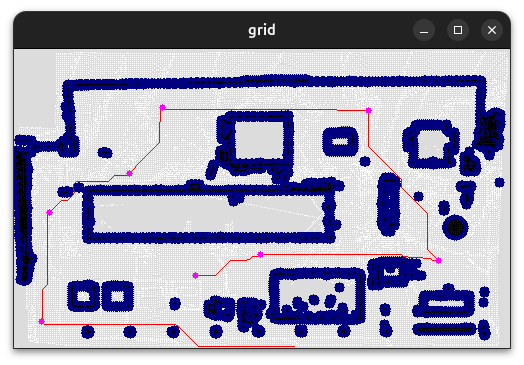

# Interactive Grid-Based Path Planning using A* and User-Defined Waypoints

## Overview

This project implements an **interactive grid-based path planning system** for a mobile robot, designed and tested on **Boston Dynamics Spot**. The system converts raw environment data into an occupancy grid, allows a human operator to **click waypoints directly in the grid**, and generates obstacle-aware paths between waypoints using the **A\*** algorithm.

Unlike coverage-oriented planners, this pipeline focuses on **precise, operator-guided navigation**, combining deterministic shortest-path planning with a responsive UI and reliable real-world execution.

The work emphasizes:
- Robust grid and obstacle preprocessing
- Human-in-the-loop waypoint specification
- A* path planning between selected waypoints
- Deterministic, debuggable execution behavior
- Tight integration with a real robotic platform

---

## Motivation
Fully autonomous planners are not always desirable in real environments. During inspection, teleoperation, or debugging, operators often need **direct control over where the robot goes**, while still benefiting from obstacle-aware planning.

This project prioritizes:
- Operator intent over full autonomy
- Predictable, explainable paths
- Fast iteration during real-world testing

Instead of decomposing the environment or enforcing coverage guarantees, the system treats navigation as a sequence of **shortest-path problems between user-selected waypoints**.

---

## Environment Representation

- Input maps are grayscale images  
  - White = free space  
  - Black = obstacles
- Converted into a grid of discrete cells at configurable resolution
- Each cell stores:
  - Occupancy state
  - Cost information
  - Neighbor connectivity (4- or 8-connected)

The grid representation provides a direct foundation for A* search and UI interaction.

---

## Map Preprocessing

Reliable A* planning requires clean obstacle boundaries and consistent free space:

- **Otsu thresholding** for binary segmentation
- Flood-fill to remove enclosed artifacts
- Morphological closing to ensure obstacle continuity
- Careful tuning to avoid over-inflation

> Over-aggressive obstacle dilation significantly reduces path options and was avoided in favor of conservative preprocessing.

---

## Interactive Waypoint Definition

An OpenCV-based UI enables **direct human control** of path intent:

- Left-clicking on the grid appends a waypoint
- Waypoints are stored as ordered grid-cell coordinates
- Optional yaw goals can be associated with specific clicks
- Paths can be saved and reloaded for repeatable testing

This approach makes planning behavior explicit and immediately visible.

---

## A* Path Planning

### Graph Construction
- Each free grid cell is treated as a node
- Edges connect neighboring free cells
- Edge cost is uniform or diagonal-weighted

### A* Search
- Heuristic: Euclidean distance in grid space
- Planning is performed **only between consecutive waypoints**
- No global replanning or optimization across the full path

This keeps planning localized, fast, and easy to debug.

---

## Path Stitching

Given waypoints `W0, W1, ..., Wn`:

1. Run A* from `W0 → W1`
2. Append resulting path
3. Repeat for each consecutive pair

The final path is a concatenation of independently planned segments, preserving operator intent while ensuring obstacle avoidance.

---

## UI & Human-in-the-Loop Control

The UI supports:
- Visualization of the occupancy grid
- Display of clicked waypoints
- Rendering of planned A* paths
- Keyboard controls for:
  - Saving waypoint sequences
  - Loading previously saved paths
  - Clearing or resetting the UI state

This tight feedback loop dramatically accelerated development and field testing.

---

## Coordinate Frames

- **Grid frame**: discrete cell indices (planning & UI)
- **Map frame**: metric coordinates (execution)
- Conversion preserves orientation and scale
- Saved paths include yaw alignment to remain valid across sessions

---

## Waypoint Execution

Execution is intentionally simple and deterministic:

- Waypoints are executed **sequentially**
- Each waypoint may include:
  - Target position
  - Optional yaw goal
- No skipping or dynamic reordering is allowed

Execution loop:
1. Query robot pose
2. Compute relative motion to next waypoint
3. Send `MoveRelativeXY` command
4. Enforce position and yaw tolerances
5. Advance only after success

This ensures precise, predictable robot behavior.

---

## Failure Handling

Early tests revealed that transient failures (e.g., command rejection or localization noise) could halt execution.

Mitigations:
- Retry logic with bounded attempts
- Timeouts per waypoint
- Clear logging for operator intervention

The system favors **graceful degradation** over aggressive replanning.

---

## Results

- Reliable obstacle-aware navigation
- Exact adherence to operator-defined waypoints
- Predictable and repeatable motion
- Successful execution on **Boston Dynamics Spot**
- Significantly improved debugging efficiency compared to autonomous planners

---

## Lessons Learned

- Human-guided planning is invaluable during development
- A* remains extremely effective when scoped properly
- Visual feedback reduces iteration time dramatically
- Simple execution logic is more robust on real robots

---

## Future Work

- Dynamic obstacle re-planning between waypoints
- Cost-map integration for terrain preference
- Path smoothing with curvature constraints
- Hybrid modes combining A* and coverage planners

---

## References

- P. Hart, N. Nilsson, B. Raphael, *A Formal Basis for the Heuristic Determination of Minimum Cost Paths*
- J.-C. Latombe, *Robot Motion Planning*
- Boston Dynamics Spot SDK Documentation

---

## Author

Sabiq Khan (sabiq.khan@comcast.net)
